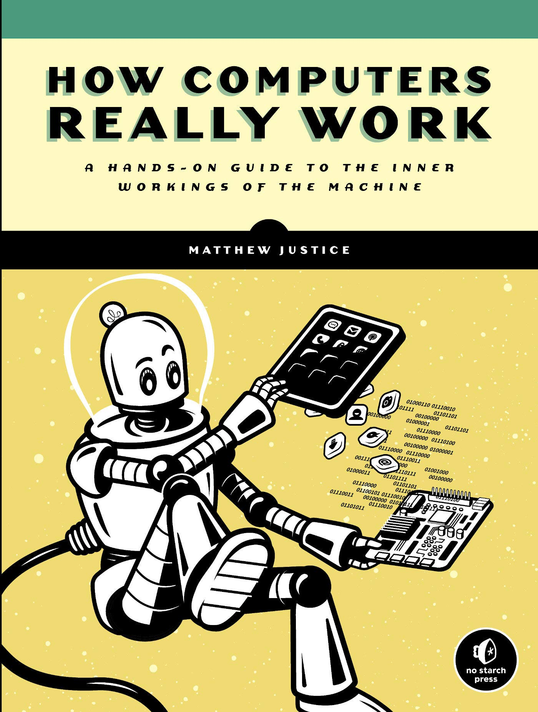

# How computers really work
Notes and explications from the book "How computers really work", by Matthew Justice. 

 

## How to download its PDF
Search on google (or whatever engine search you use). I'm not being rude, to be clear, my point is help you to develop one of the most important skills of a developer: __the ability to search__. 

 

